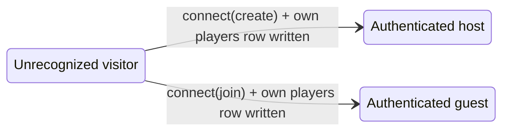
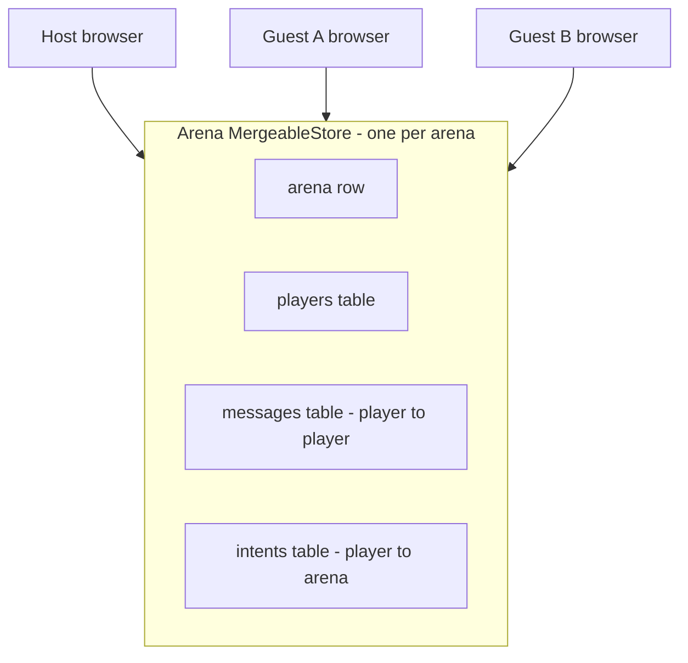
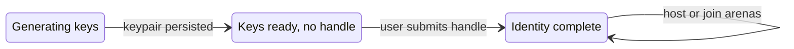

# arena-prototype — Infrastructure Plan

> **Robot arena** in the browser: a **host** opens an arena from their web client, operates connected robots, and shares a URL so **guests** can join from their own browsers. Vite + TanStack Router + TinyBase + Zod, with **one transport per arena** — Cloudflare Durable Objects **or** Trystero P2P. **No application REST API and no app-level transport code** — every arena is a *single shared TinyBase store* and the active synchronizer moves it. Open questions marked ❓.

This project should be a Vite app based on TanStack, with TanStack Router.

---

## Product vision

| Actor | What they do |
|---|---|
| **Host** | Creates an arena, runs the host browser session (robot control UI), shares the arena URL (+ invite code) with others. Owns the `arena` row and robot-facing authority. |
| **Guest** | Opens the shared link in their own browser, joins the synced arena, participates (view/control scope TBD per feature). |
| **Unrecognized visitor** | Landed on the arena URL but has not finished `connect()` yet — not in the synced `players` table. |

There is no account system with passwords. Each browser holds a **persistent identity**:

- **Cryptographic core** — an Ed25519 signing keypair in local storage; a stable `PlayerId` is derived from the public key.
- **Handle** — a user-chosen display name assigned **on first app load** (required before hosting or joining any arena). The same handle is reused for every arena that browser participates in.

The **invite code** is the shared secret that gates the sync connection — possessing it proves intent to enter **this** arena. A browser's `PlayerId` and `handle` are written into its own `players` row when it joins. v1 trusts these self-reported identities among invited (good-citizen) participants; cryptographic challenge-response that rejects impostors is a later hardening step.

**Shareable link shape (conceptual):** `https://<app>/arena/<arenaId>?invite=<inviteCode>&t=<transport>` — the `t` parameter pins the arena's transport (`do` or `p2p`) so every guest connects the same way; exact format ❓.

**Coordination:** There is **no REST/HTTP application API** and **no application-level transport messaging**. Each arena is **one shared TinyBase `MergeableStore`** holding four tables — `arena` (arena state), `players` (presence), `messages` (player↔player), and `intents` (player→arena). Clients read and write rows; the active synchronizer reconciles them. Application code never opens, reads, or writes the transport — it only touches store rows. *How* rows travel depends on the arena's one transport, pinned in its URL:

- **`do`** — `createWsSynchronizer` ⇄ `WsServerDurableObject` own a WebSocket. (The WebSocket, the Worker, and the Durable Object exist **only** in this transport.)
- **`p2p`** — a Trystero room over WebRTC carries the same store; no WebSocket, no Worker, no DO.

An arena uses **exactly one** transport — never both — chosen when the arena is created and immutable for its lifetime.

**Terminology:** **Handle** = human-readable name (persistent per browser). **PlayerId** = stable id derived from the signing key (not chosen by the user). In prose, **host** and **guest** are roles. In code, synced participants are rows in `players` with `role: 'host' | 'guest'`.

---

## Principles

### Fail brittle

**If something required is missing or malformed, stop with a clear error — never guess a default or silently degrade.** A prototype is better served by a loud, specific failure than by mysterious half-working behavior.

- Missing or invalid input — a route param, an `inviteCode`, an arena-config field, an identity, a row that fails Zod `.parse()` — halts at an **error state**, not a fallback.
- Every error names **what** is missing, **why** it matters, and offers **≥1 remediation action** ("go home", "paste a full link", "create a new arena").
- Errors are values the UI renders (an `ErrorScreen` or inline error), not exceptions that get swallowed.
- Orthogonal to the good-citizen model: we do **not** police *intent* (who writes what), but we **do** reject malformed or absent *input*.

Examples: `/arena/:id` with missing/invalid `t` → "This arena link is missing its transport." → [Go home] [Paste a full link]; missing `invite` → "This link has no invite code."; `connect()` throws on an unset handle or `mode: 'create'` without `config`; arena create with `maxGuests` unset → validation error, **no implicit default**.

A schema-level `.default()` (e.g. `disconnectGraceMs`) is *specification*, not guessing — that is allowed. Inventing behavior for genuinely unspecified input is not.

### No backwards compatibility (during development)

**Assume the whole system can be wiped and restarted at will.** While prototyping there is no installed base to protect:

- No data migrations, no schema-version upgrade paths, no compat shims. Change a Zod schema freely; if persisted data no longer fits, **wipe it**.
- Resettable state includes: local TinyBase stores (identity, preferences), synced arena stores, DO SQL storage, and any deployed arena.
- A breaking change is a normal change — bump and reset, never branch behavior on an old shape.
- Persisted identities are disposable: clearing local storage and regenerating keys is an acceptable "fix".

This keeps schemas and the store layout free to evolve until v1 stabilizes. (The `version` field on `ArenaConfigExport` is a forward marker only — no importer needs to honor old versions yet.)

### Latest stable libraries

**Adopt the current stable release of every dependency.** No pinning to old majors, no lagging behind:

- When scaffolding or adding a package, install the latest stable version (`npm install <pkg>@latest`) and record it in *Library versions*.
- Verify versions are current before each milestone; the table notes the date it was last checked.
- This pairs with *No backwards compatibility* — there is no installed base to hold a dependency back. Prereleases/betas are excluded; "latest stable" means the published `latest` dist-tag.

---

## Project identity

| Surface | Value |
|---|---|
| Repo / directory | `arena-prototype` |
| Root `package.json` `"name"` | `"arena-prototype"` |
| README title | `# arena-prototype` |
| Web app (static) | **GitHub Pages** (`qromabots/arena-prototype` or org Pages URL) |
| Wrangler worker (`do` transport only) | `arena-prototype` — sync transport only; hosted separately from Pages |

The **gathering space** is an **arena** in domain language, APIs, routes, and types — not "lobby" or "room". Hosts create arenas; guests join via a shared URL.

---

## Library versions (latest stable, verified 2026-05-16)

Per the *Latest stable libraries* principle, install the current stable release; the figures below are the latest verified on the plan date.

| Package | Version |
|---|---|
| `tinybase` | 8.4.0 |
| `react` / `react-dom` | 19.2.6 |
| `vite` | 8.0.13 |
| `@tanstack/react-router` | 1.170.3 |
| `@tanstack/router-devtools` | 1.167.0 |
| `zod` | 4.4.3 |
| `typescript` | 6.0.3 |
| `wrangler` | 4.92.0 (`do` transport only) |
| `@cloudflare/workers-types` | 4.20260516.1 (`do` transport only) |
| `trystero` | 0.24.0 (`p2p` transport only) |

TinyBase's DO synchronizer (`tinybase/synchronizers/synchronizer-ws-server-durable-object`) and SQL storage persister (`tinybase/persisters/persister-durable-object-sql-storage`) ship in the main `tinybase` package — no separate installs.

---

## Repository layout

```
arena-prototype/
├── package.json                      ← "name": "arena-prototype", workspaces: ["platform/*"]
├── README.md
├── tsconfig.base.json                ← shared TS settings (strict, path aliases)
└── platform/
    ├── web/                          ← Vite + React SPA (static build → GitHub Pages)
    ├── edge/                         ← Cloudflare Worker + ArenaDO (the `do` transport only)
    └── shared-types/                 ← single npm workspace package
        └── src/core/
            ├── brand.ts              ← Brand<T,B> utility + z.brand() helpers
            ├── ids.ts                ← PREFIX registry (player, arena, message); make/parse/is; zId schemas
            ├── keys.ts               ← Ed25519 signing-key schemas (PlayerId source)
            ├── schemas.ts            ← zArena, zArenaConfig, zPlayer, zMessage, zTransport, …
            ├── store.ts              ← ArenaStore + LocalStore interfaces
            ├── identity.ts           ← keypair generation, PlayerId derivation
            └── store-ownership.ts    ← write-ownership map per store region (good-citizen convention)
```

`platform/shared-types/` is one npm package consumed by both `platform/web/` and `platform/edge/`.

Adding a feature: new routes/components under `platform/web/` and optional new Zod modules under `shared-types/src/core/`.

---

## Access model

Three **connection states** — distinct from the synced `role` field on a `players` row:

Host is fixed for the arena's lifetime — the creator stays host; authority never transfers to a guest.



| State | Definition | Arena store access |
|---|---|---|
| **Unrecognized** | Opened shared arena URL; `connect()` not yet completed | Not syncing the arena store; no row in `players` |
| **Guest** | Recognized browser user; `role: 'guest'` | Reads synced arena state; writes its own `players` row + its own `messages` / `intents` rows (good-citizen convention) |
| **Host** | Recognized user operating the robot arena; `role: 'host'` | Writes the `arena` row + its own `players`/`messages` rows |

**Typical flows:**

1. **Host creates arena** — client generates `arenaId` + `inviteCode`, picks a transport, calls `ArenaStore.connect({ mode: 'create', ... })`. The first merge establishes the `arena` row and the `host` `players` row. UI shows the shareable URL (carrying `invite` + `t`).
2. **Guest joins** — opens shared URL → unrecognized → the route builds the matching transport → `ArenaStore.connect({ mode: 'join', inviteCode, ... })` → store sync begins → guest writes its own `players` row as `guest`.

**UI:** `/arena/:arenaId` shows a join gate for unrecognized visitors; host and guests both land here after connect, with role-appropriate chrome (host: robot arena + share link; guest: participant view).

**Sync-only rule:** All arena data and intents go through the shared store. The `inviteCode` gates the sync connection, so a visitor cannot sync without the secret the host shared; once connected, `players` rows are self-reported and trusted (good-citizen model).

`zPlayer.role` is `z.enum(['host', 'guest'])` only.

---

## Sync abstraction layer

The arena shell and robot I/O must not depend on TinyBase or Trystero directly. **One** abstraction does it all:

| Layer | Scope | Purpose |
|---|---|---|
| **ArenaStore** | One per arena | The whole arena: presence, status, and the `messages` queue — all in a single shared store |

`ArenaStore` swaps between TinyBase+DO and Trystero without UI changes.

### One store per arena

Earlier drafts split the arena into a control-plane store plus two unguessable channel stores per host↔guest pair. The good-citizen model makes that isolation pointless: a single `MergeableStore` per arena is simpler and removes the channel-grant/encryption subsystem entirely.



There are three directions of communication, each with a clear home in the one store:

- **arena → players** — the host writes the `arena` row; clients react via subscriptions.
- **player ↔ player** — directed robot/control traffic as `messages` rows (`from` / `to` `PlayerId`s); consumers filter by `to`.
- **player → arena** — a guest sends information *to the arena itself* (requests, actions, reports) as `intents` rows. There is no `to`: the target is the arena, and the host (acting as arena authority) consumes them. Durable per-player state still lives on the `players` row (e.g. `isReady`); `intents` carries events and requests.

Every client syncs the whole store; for `maxGuests ≤ 8` and small JSON payloads the fan-out is negligible (video/binary never goes through the store). Per-pair isolation, if ever needed, is a v2 concern.

### Interfaces (`platform/shared-types/src/core/store.ts`)

```ts
// Connection lifecycle — surfaced so UI never inspects the transport directly
const zConnectionState = z.enum([
  'idle', 'connecting', 'connected', 'reconnecting', 'failed', 'disconnected',
]);
type ConnectionState = z.infer<typeof zConnectionState>;

interface ArenaStore {
  getArena(): Arena
  getPlayers(): Player[]

  onArenaChange(cb: (arena: Arena) => void): () => void
  onPlayerJoined(cb: (player: Player) => void): () => void
  onPlayerLeft(cb: (playerId: PlayerId) => void): () => void
  onPlayerChanged(cb: (player: Player) => void): () => void
  onStatusChanged(cb: (status: ArenaStatus) => void): () => void
  onConnectionStateChange(cb: (state: ConnectionState) => void): () => void

  setReady(playerId: PlayerId, ready: boolean): void
  setStatus(status: ArenaStatus): void   // host only (convention)
  heartbeat(): void                      // refresh own players.lastSeen / isConnected

  connect(opts: ConnectOptions): Promise<void>
  disconnect(): void
  getConnectionState(): ConnectionState

  // Player ↔ player — same store, `messages` table
  sendMessage(to: PlayerId, payload: unknown): void
  onMessage(cb: (msg: Message) => void): () => void   // delivers rows where to === self

  // Player → arena — same store, `intents` table
  sendIntent(payload: unknown): void                  // any player → the arena
  onIntent(cb: (intent: Intent) => void): () => void  // host observes player intents
}

// ConnectOptions — no HTTP; passed to the tinybase or trystero adapter
interface ConnectOptions {
  arenaId:    ArenaId
  inviteCode: string
  identity:   PlayerIdentity   // must include handle (see app bootstrap)
  mode:       'create' | 'join'
  config?:    ArenaConfig      // required when mode==='create'; ignored on join
}
// connect() throws if identity.handle is unset, or if mode==='create' without config

// Local (never synced)
interface LocalStore {
  getIdentity(): PlayerIdentity | null
  saveIdentity(identity: PlayerIdentity): void
  getPreferences(): Preferences
  savePreferences(prefs: Preferences): void
}
```

### Implementations (`platform/web/src/sync/`)

```
platform/web/src/sync/
  index.ts                ← createArenaStore(transport) factory; the only transport switch
  SyncContext.tsx         ← React context exposing the interfaces
  tinybase/
    ArenaStore.ts         ← MergeableStore + createWsSynchronizer ⇄ ArenaDO
    LocalStore.ts         ← createLocalPersister
  trystero/
    ArenaStore.ts         ← MergeableStore replicated over a Trystero room
```

The local store is always TinyBase (`createLocalPersister`) — only the arena store swaps transport.

### Transport selection (one per arena)

An arena commits to a **single** transport at creation and never mixes the two. The choice is encoded in the arena's URL — `?t=do` (TinyBase + Durable Objects) or `?t=p2p` (Trystero) — so every guest opening the share link connects the same way. `sync/index.ts` is the **only** place a concrete transport is named:

```ts
// platform/shared-types/src/core/schemas.ts
export const zTransport = z.enum(['do', 'p2p']);
export type Transport = z.infer<typeof zTransport>;

// platform/web/src/sync/index.ts
function createArenaStore(transport: Transport): ArenaStore {
  switch (transport) {
    case 'do':  return new TinyBaseArenaStore();   // WebSocket synchronizer + Durable Object
    case 'p2p': return new TrysteroArenaStore();   // Trystero WebRTC room
  }
}
```

The TanStack Router route for `/arena/:arenaId` reads and validates `t` from the URL, calls `createArenaStore(t)` **once**, and provides the resulting `ArenaStore` through `SyncContext`. Route and UI code import only `createArenaStore` and the interfaces — never a concrete `tinybase/` or `trystero/` module. An arena's transport is immutable for its lifetime: no fallback, no mid-session switch, no running both at once.

### React context

```ts
// platform/web/src/sync/SyncContext.tsx
const SyncContext = createContext<{
  arena: ArenaStore
  local: LocalStore
} | null>(null);
```

Arena state via `useArenaStore()`; robot/control traffic via `sendMessage` / `onMessage` — never TinyBase/Trystero APIs directly in UI.

### Reactivity (transport-agnostic hooks)

The UI never reads the store imperatively. A thin hook layer (`sync/hooks.ts`) turns the `ArenaStore` interface into reactive React values via `useSyncExternalStore` — built **only** on the interface's `onX` subscriptions, so it behaves identically for `do` and `p2p`:

```ts
// platform/web/src/sync/hooks.ts
useArenaStore(): ArenaStore             // imperative calls — setReady, sendMessage, sendIntent
useArena(): Arena                       // re-renders on arena-row changes
usePlayers(): Player[]                  // re-renders on join / leave / change
usePlayer(id: PlayerId): Player | undefined
useConnectionState(): ConnectionState
useOnMessage(cb: (m: Message) => void): void   // incoming player↔player messages
useOnIntent(cb: (i: Intent) => void): void     // host: incoming player→arena intents
```

Each hook is `useSyncExternalStore(arena.onX, arena.getX)`. Both transports back the arena with a TinyBase `MergeableStore` — only the synchronizer differs — so the change events already exist; the adapter must return **referentially stable snapshots** (cache `getPlayers()` etc.; emit a new reference only on real change) so `useSyncExternalStore` neither tears nor loops. Components depend on these hooks — never on TinyBase's own `ui-react` hooks or Trystero APIs, which would leak the transport into the UI.

### Authority — good-citizen store ownership

There is **no runtime authority enforcement** in either transport. Authority is a **write-ownership convention**: host and guests write only to the store regions they own and treat the rest as read-only. v1 assumes good citizens — neither the Durable Object nor the Trystero host rejects an out-of-region write.

`core/store-ownership.ts` exports this map as data (one source of truth, usable for optional dev-mode assertions):

| Store region | Writer | Everyone else |
|---|---|---|
| `arena` row (status, config) | Host | read-only |
| own `players` row | That player | read-only |
| own `messages` rows (`from === self`) | That player | read; consume rows where `to === self` |
| own `intents` rows (`from === self`) | That player | host reads and consumes |

The same map governs both transports — there is no merge interception and no per-transport authority code.

### No REST API, no app-level transport code

| Do | Don't |
|---|---|
| `ArenaStore.connect()` / `disconnect()` | `fetch('/api/...')` for arena lifecycle |
| TinyBase merge via the active synchronizer | TanStack Query / REST CRUD |
| Read/write store rows; the synchronizer moves them | App code that opens or handles transport sockets |
| Client-generated `arenaId` + `inviteCode` on host create | `POST` to allocate arena ids |

For the `do` transport, `platform/edge/` is **sync transport only**: `WS /sync/:arenaId` → `ArenaDO`. Not a general API layer. For `p2p`, `platform/edge/` does not exist at all.

---

## Branded type system

**Principle: Zod schemas are the single source of truth. All domain types are inferred from Zod schemas via `z.infer`. Branded types use Zod's `.brand()` — never a separate `type Foo = Brand<string, 'Foo'>` declaration alongside a schema.**

```
Zod schema (.brand(), .transform(), .refine())
  └── z.infer<typeof zFoo>  →  TypeScript type (branded)
                                  ↕
                          Transport adapter
                          (serialize/deserialize per transport)
```

### IDs (`core/ids.ts`)

All entity IDs use `"<prefix>_<ulid>"`. The Zod schema validates the prefix and produces the branded type.

```ts
export const PREFIX = {
  player:   'plyr',
  arena:    'arena',
  message:  'msg',
  intent:   'intent',
} as const;

export const zPlayerId = z.string()
  .refine(s => s.startsWith(PREFIX.player + '_'), 'Invalid PlayerId')
  .brand<'PlayerId'>();
export type PlayerId = z.infer<typeof zPlayerId>;

export const zArenaId = z.string()
  .refine(s => s.startsWith(PREFIX.arena + '_'), 'Invalid ArenaId')
  .brand<'ArenaId'>();
export type ArenaId = z.infer<typeof zArenaId>;

export const zMessageId = z.string()
  .refine(s => s.startsWith(PREFIX.message + '_'), 'Invalid MessageId')
  .brand<'MessageId'>();
export type MessageId = z.infer<typeof zMessageId>;

export const zIntentId = z.string()
  .refine(s => s.startsWith(PREFIX.intent + '_'), 'Invalid IntentId')
  .brand<'IntentId'>();
export type IntentId = z.infer<typeof zIntentId>;

make<K extends keyof typeof PREFIX>(kind: K): BrandFor<K>
strip<T extends z.BRAND<string>>(id: T): string
```

### Cryptographic keys (`core/keys.ts`)

Only the Ed25519 signing keypair — its sole job in v1 is deriving a stable `PlayerId`. (X25519 encryption keys are gone with the channel-grant subsystem; reintroduce if challenge-response or payload encryption is added later.)

```ts
export const zSigningPubKeyBytes = z.string().regex(/^[A-Za-z0-9_-]{43}$/).brand<'SigningPubKeyBytes'>();
export const zSigningPrivKeyJwk  = z.string().min(1).brand<'SigningPrivKeyJwk'>();
```

`PlayerId` is derived deterministically from `SigningPubKeyBytes`:

```
PlayerId = "plyr_" + base64url(rawEd25519PubKeyBytes)
```

Same browser always gets the same `PlayerId` from the same keypair. Derivation runs identically in browser and Cloudflare Worker (`crypto.subtle`).

### Domain types (`core/schemas.ts`)

```ts
export const zArenaStatus = z.enum(['waiting', 'active', 'finished']);
export type ArenaStatus = z.infer<typeof zArenaStatus>;

export const zTransport = z.enum(['do', 'p2p']);
export type Transport = z.infer<typeof zTransport>;

// Portable arena settings — host-tunable, no identity or runtime fields.
// Safe to export to JSON; importing to seed a new arena is a later step.
export const zArenaConfig = z.object({
  name:               z.string().min(1).max(60).optional(),
  maxGuests:          z.number().int().min(1).max(8),  // excluding host; required — no default (fail brittle)
  seed:               z.string(),
  disconnectGraceMs:  z.number().int().min(0).default(15_000),
});
export type ArenaConfig = z.infer<typeof zArenaConfig>;

// Versioned wrapper for export/import as a file or shared blob.
export const zArenaConfigExport = z.object({
  kind:     z.literal('arena-config'),
  version:  z.literal(1),
  config:   zArenaConfig,
});
export type ArenaConfigExport = z.infer<typeof zArenaConfigExport>;

// Synced arena row = portable config + identity + runtime state.
export const zArena = zArenaConfig.extend({
  id:            zArenaId,
  inviteCode:    z.string(),
  hostPlayerId:  zPlayerId,
  status:        zArenaStatus,
});
export type Arena = z.infer<typeof zArena>;

export const zHandle = z.string()
  .min(2).max(24)
  .regex(/^[a-zA-Z0-9_-]+$/, 'Handle: letters, numbers, underscore, hyphen only')
  .brand<'Handle'>();
export type Handle = z.infer<typeof zHandle>;

export const zPlayer = z.object({
  id:             zPlayerId,
  handle:         zHandle,
  avatarColor:    z.string(),
  role:           z.enum(['host', 'guest']),
  isConnected:    z.boolean(),
  isReady:        z.boolean(),
  joinedAt:       z.number(),
  lastSeen:       z.number(),
  signingPubKey:  zSigningPubKeyBytes,
});
export type Player = z.infer<typeof zPlayer>;

// Rows in the `messages` table — directed player ↔ player traffic.
export const zMessage = z.object({
  id:       zMessageId,
  from:     zPlayerId,
  to:       zPlayerId,
  sentAt:   z.number(),
  payload:  z.unknown(),   // app-defined; robot cmds, etc.
});
export type Message = z.infer<typeof zMessage>;

// Rows in the `intents` table — a player sends these to the arena. No `to`:
// the target is the arena, and the host (as arena authority) consumes them.
export const zIntent = z.object({
  id:       zIntentId,
  from:     zPlayerId,
  sentAt:   z.number(),
  payload:  z.unknown(),   // app-defined; requests, actions, reports
});
export type Intent = z.infer<typeof zIntent>;
```

### Transport adapter boundary

Adapters receive and emit untyped data. The adapter calls `.parse()` on the appropriate schema before handing anything to domain code.

```ts
const player  = zPlayer.parse(rawTinyBaseRow);
const message = zMessage.parse(rawRow);
```

No domain code calls `.parse()` directly — only adapters.

---

## Browser identity and auth

Identity is **per browser**, not per arena. Two parts: the signing keypair (automatic) and the **handle** (user must choose).

### App bootstrap (handle required)

On first visit to the static app (any route), the user must **choose a handle** before hosting or joining an arena.



| Step | What happens |
|---|---|
| 1 | App loads → ensure the signing keypair exists (`generateKeypair()` if missing) |
| 2 | If `identity.handle` is empty → show **handle onboarding** (blocks rest of app) |
| 3 | User picks handle → `saveIdentity({ ...keys, handle })` |
| 4 | User may create/join arenas; every `players` row uses this handle |

**Routing:** TanStack Router `beforeLoad` (or root layout guard) redirects to `/welcome` when `!identity.handle`. `/settings` allows changing handle later (updates local store; next arena connect propagates the updated handle on merge).

**Uniqueness:** Handles are **not** globally unique — display labels only. `PlayerId` is the canonical identity. ❓ optional per-arena duplicate handle warning in UI.

```ts
export const zPlayerIdentity = z.object({
  playerId:       zPlayerId,
  signingPubKey:  zSigningPubKeyBytes,
  signingPrivKey: zSigningPrivKeyJwk,
  handle:         zHandle,
  avatarColor:    z.string(),
});
export type PlayerIdentity = z.infer<typeof zPlayerIdentity>;

hasCompleteIdentity(id: PlayerIdentity | null): id is PlayerIdentity
  // returns true when handle is set and keys present
```

### Local identity (keys + handle)

Persisted in the **local TinyBase store** (`identity` singleton):

| Field | Source |
|---|---|
| Signing keypair | Auto-generated on first visit |
| `handle` | **User-assigned** on bootstrap (required) |
| `avatarColor` | User or random default on bootstrap |

`PlayerId` is derived from the signing public key (`plyr_` + base64url(pubkey)). Same browser → same `PlayerId` and (by default) same **handle** across all arenas and sessions.

**No passwords, no OAuth in v1.** Trust model: knowledge of the arena `inviteCode` gates the connection; `PlayerId` / `handle` are self-reported by good-citizen participants once connected.

### Joining an arena (invite-gated connection + shared-state join)

`ArenaStore.connect()` does **not** run an application-level handshake over the socket. Joining is two steps:

**1. Connection gate (`inviteCode`).** `connect()` hands `arenaId` + `inviteCode` to the chosen transport, which accepts or rejects the *connection* on invite-code match. This is the only transport-level check, and the one place the two transports differ:

- **`do`** — `inviteCode` travels in the sync URL; `ArenaDO` rejects the WebSocket upgrade on mismatch.
- **`p2p`** — `inviteCode` is the Trystero room password; a wrong password never joins the room.

Without the shared secret a client cannot sync the store at all.

**2. Shared-state join.** Once connected the client is syncing the arena `MergeableStore`. Joining is just **writing rows**, identical for both transports:

```
1. Load local identity (keys + handle).
2. connect() → transport accepts the connection (invite gate above).
3. Client writes its own `players` row (id, handle, avatarColor, role, signingPubKey, joinedAt).
   Host path (mode 'create') also writes the initial `arena` row.
4. The merge propagates the row to all participants; PlayerId is checked to derive
   from signingPubKey (deterministic) by anyone displaying the player.
5. Host and guests exchange robot/control traffic by writing `messages` rows;
   guests send requests/actions to the arena by writing `intents` rows.
```

No `auth_start` / `auth_nonce` / `auth_verify` messages, no per-transport handshake state machine — the synchronizer moves the bytes, application code only reads and writes store rows.

### Host vs guest identity

Same identity machinery for host and guest. The difference is the **role** cell in the `players` row:

- **`connect({ mode: 'create' })`** — the client that generated `arenaId` + `inviteCode` becomes `host` (`arena.hostPlayerId`).
- **`connect({ mode: 'join' })`** — joiners are `guest`.

There is no separate identity type and no runtime enforcement — host authority is the store write-ownership convention.

```ts
// identity module (platform/shared-types/src/core/identity.ts)
generateKeypair(): Promise<Omit<PlayerIdentity, 'handle'> & { handle?: never }>
loadIdentity(): Promise<PlayerIdentity | null>
saveIdentity(id: PlayerIdentity): Promise<void>
setHandle(handle: Handle): Promise<PlayerIdentity>   // bootstrap + settings
hasCompleteIdentity(id: PlayerIdentity | null): boolean
derivePlayerId(key: SigningPubKeyBytes): PlayerId
```

---

## State — TinyBase stores

### Local store (each browser, `localStorage`)

Persisted via TinyBase `createLocalPersister`. Never synced.

```
identity {                        ← singleton row
  playerId:        PlayerId
  signingPubKey:   SigningPubKeyBytes
  signingPrivKey:  SigningPrivKeyJwk
  handle:          Handle          ← required for app use; set at bootstrap
  avatarColor:     string
}

preferences {                     ← singleton row
  soundEnabled:  boolean
  theme:         string
}
```

### Arena store (one shared `MergeableStore` per arena, synced)

`createMergeableStore()` on every client (and on `ArenaDO` for the `do` transport).

```
arena {                           ← singleton
  id, inviteCode, hostPlayerId, status,
  name?, maxGuests, seed, disconnectGraceMs
}

players {                         ← one row per connected browser user
  id, handle, avatarColor, role,
  isConnected, isReady, joinedAt, lastSeen,
  signingPubKey
}

messages {                        ← player ↔ player; append-only (CRDT-friendly row keys)
  id:       MessageId
  from:     PlayerId
  to:       PlayerId
  sentAt:   number
  payload:  string                ← JSON string or app binary ref
}

intents {                         ← player → arena; append-only (CRDT-friendly row keys)
  id:       IntentId
  from:     PlayerId
  sentAt:   number
  payload:  string                ← request / action / report; consumed by the host
}
```

`sendMessage(to, payload)` appends a `messages` row with `from = self`; `onMessage` delivers rows where `to = self`. `sendIntent(payload)` appends an `intents` row with `from = self`; the host's `onIntent` observes every intent. Old rows in both tables are pruned by the host (or by a TTL on `sentAt`) ❓.

---

## The `do` transport — Cloudflare Durable Objects

Used only when an arena's URL carries `t=do`. Sync transport only — not a REST API. The Worker routes a WebSocket by `arenaId` to a single `ArenaDO`.

### Topology

```
Browser (MergeableStore) ←── WebSocket (sync) ──→ ArenaDO (MergeableStore) ←── WebSocket ──→ Browser
```

The DO is an always-on peer. TinyBase's `WsServerDurableObject` handles `MergeableStore` sync; the DO does not inspect application data.

### TinyBase DO sync

**Client:** `createWsSynchronizer` from `tinybase/synchronizers/synchronizer-ws-client`
**DO:** extend `WsServerDurableObject` from `tinybase/synchronizers/synchronizer-ws-server-durable-object`

```ts
export class ArenaDO extends WsServerDurableObject {
  createPersister() {
    return createDurableObjectSqlStoragePersister(this.store, this.ctx.storage);
  }

  async fetch(request: Request): Promise<Response> {
    // Connection gate only: reject the WebSocket upgrade if the
    // invite code in the URL does not match this arena.
    if (!this.inviteMatches(request)) {
      return new Response('invalid invite', { status: 403 });
    }
    return super.fetch(request);   // the TinyBase synchronizer owns the socket
  }

  // No webSocketMessage override: the DO does not inspect or referee merge
  // traffic. It is a TinyBase sync peer with SQL persistence.
}
```

**Persistence:** `createDurableObjectSqlStoragePersister` (SQL storage, fragmented mode). Requires `[[migrations]]` with `new_sqlite_classes` in `wrangler.toml`.

**Store type:** `createMergeableStore()` on both client and DO.

### Connection gate (invite code)

There is no application-level handshake over the socket. The only check is at connection time: the `inviteCode` travels in the sync URL, and `ArenaDO.fetch` rejects the WebSocket upgrade if it does not match this arena. After the upgrade, the TinyBase synchronizer owns the socket and the DO does not inspect merge traffic.

### Arena lifecycle

- **Create:** host client generates `arenaId` (`make('arena')`) + `inviteCode`, connects with `mode: 'create'`, writes the initial `arena` + host `players` row.
- **Join:** guest connects with `mode: 'join'` + invite code from the shared URL.
- DO alarm on first authenticated activity (24h TTL, resets on activity). No live connections at alarm → clear SQL storage.
- `arena.status = 'finished'` → cleanup after grace period.

### Reconnection

`MergeableStore` + `createWsSynchronizer` handle merge reconciliation. The client calls `connect()` again (same keypair, same invite gate), then syncs from DO SQL persistence.

### Sync transport (edge routing only)

```
WS  /sync/:arenaId   →  ArenaDO   (one shared store; invite-gated connection)
```

`platform/edge/` is the WebSocket, the Worker, and the Durable Object — none of which exist for the `p2p` transport.

---

## The `p2p` transport — Trystero

Used only when an arena's URL carries `t=p2p`. No Worker, no Durable Object, no WebSocket — the static app on GitHub Pages is sufficient.

- The arena `MergeableStore` is replicated over a single Trystero room.
- Room name derives from `arenaId`; the room **password** is the `inviteCode` — that is the connection gate.
- `sync/trystero/ArenaStore.ts` bridges `MergeableStore` changes to Trystero room broadcasts and back, exposing the exact same `ArenaStore` interface.
- Host authority is the same good-citizen write-ownership convention; there is no privileged peer.

---

## Web app (`platform/web/`)

### Stack

| Concern | Choice |
|---|---|
| Build | Vite |
| Framework | React 19 |
| Routing | TanStack Router |
| State | TinyBase (`createLocalPersister` + `createMergeableStore`) |
| Schemas | Zod (via `platform/shared-types`) |
| Types | TypeScript strict + branded types |
| Deployment | GitHub Pages (static SPA); `do` arenas also need a Cloudflare Worker, `p2p` arenas do not |

No TanStack Query, no REST client — TinyBase reactive subscriptions are the only arena data path.

### Routes

```
/welcome                ← handle onboarding (required if identity.handle unset)
/                       ← home (guarded: requires handle); create arena or join via link
/arena/:arenaId         ← reads `t`/`invite` from URL (missing/invalid → ErrorScreen) → join gate → arena shell
/settings               ← edit handle, avatarColor, theme (local store; applies to future connects)
```

Robot control UI, video streams, and hardware bridges are out of scope for this infrastructure plan — they plug into the arena shell and ride the `messages` table.

### UI strategy

Prototype-grade and deliberately thin. The UI is a **pure function of three inputs** — local identity, the arena store, and connection state — rendered through the transport-agnostic reactive hook layer (see *Reactivity* under Sync abstraction layer); no local view state beyond form inputs.

- **No component library or design system in v1.** Plain React components + minimal CSS (CSS Modules or a single stylesheet). Layout over polish.
- **One screen per route.** Each route is a thin shell that wires store subscriptions to a few shared components.
- **Role-conditional chrome, not role-conditional routes.** `/arena/:arenaId` renders host / guest / join-gate variants of the same shell.
- **Reusable pieces:** `HandleForm`, `ConnectionBadge`, `ShareLink`, `PlayerList`, `JoinGate`, `ArenaShell`, `ErrorScreen` (named cause + remediation actions — see *Fail brittle*), and a `CommsDebugPanel` (stand-in until real robot UI exists).

```
platform/web/src/
  routes/        ← one file per route (welcome, index, arena.$arenaId, settings)
  components/    ← shared presentational components
  sync/          ← ArenaStore/LocalStore wiring (see Sync abstraction layer)
```

---

## Build pipeline

```bash
npm run dev      # Vite dev server in platform/web/
npm run build    # vite build → platform/web/dist/
```

### Vite config for GitHub Pages

GitHub Pages serves static files only (no Workers, no WebSocket termination on Pages itself).

```ts
// platform/web/vite.config.ts (illustrative)
export default defineConfig({
  base: process.env.GITHUB_PAGES === 'true'
    ? '/arena-prototype/'   // project Pages: https://<org>.github.io/arena-prototype/
    : '/',
  // ...
});
```

- **TanStack Router** — set `basepath` to match Vite `base` in production.
- **Env** — `VITE_SYNC_WS_ORIGIN` (e.g. `wss://arena-prototype.<account>.workers.dev`) for the `do` transport; unused for `p2p`-only deployments.
- **SPA routing** — copy `index.html` to `404.html` on build so `/arena/:id` deep links work on Pages.

---

## Deployment

Split into a **static app** (GitHub Pages) and, only for the `do` transport, a **sync Worker** (Cloudflare).

```
┌─────────────────────────────────────────────────────────────────┐
│  GitHub Pages (static only)                                      │
│  https://<org>.github.io/arena-prototype/                         │
│  platform/web/dist/  →  gh-pages branch or GitHub Actions artifact│
└────────────────────────────┬──────────────────────────────────────┘
                             │ wss:// (VITE_SYNC_WS_ORIGIN) — `do` arenas only
                             ▼
┌─────────────────────────────────────────────────────────────────┐
│  Cloudflare Worker (only for the `do` transport)                  │
│  platform/edge  →  wrangler deploy                                │
│  WS /sync/:arenaId  → ArenaDO                                     │
└─────────────────────────────────────────────────────────────────┘

`p2p` arenas: no Worker required; the static app on Pages is sufficient.
```

### GitHub Pages

| Item | Choice |
|---|---|
| Hosting | GitHub Pages from `platform/web/dist` |
| CI | `.github/workflows/deploy-pages.yml` — build on push to `main`, deploy via `actions/upload-pages-artifact` + `actions/deploy-pages` |
| `base` path | `/arena-prototype/` for project site (adjust if repo name differs) |
| Secrets | None for static deploy; `VITE_SYNC_WS_ORIGIN` set in workflow `env` or repo Variables (for `do`) |

**Shareable arena URLs** use the Pages origin, e.g.
`https://<org>.github.io/arena-prototype/arena/<arenaId>?invite=<code>&t=p2p`.

### Sync Worker (`do` transport only)

```bash
cd platform/edge && wrangler deploy
```

CORS does not apply to WebSockets; ensure the Worker accepts connections from the Pages origin if adding origin checks.

### Local dev

```bash
npm run dev                          # Vite, base /
# `do` transport only, second terminal:
cd platform/edge && wrangler dev     # local WS; set VITE_SYNC_WS_ORIGIN=ws://localhost:8787
```

---

## Open questions

- ❓ Invite-code format (length, charset) — required, no default; missing/invalid → `ErrorScreen` per *Fail brittle*
- ❓ Transport URL param shape: `?t=do|p2p` query (assumed) vs path segment — missing/invalid → `ErrorScreen` per *Fail brittle*
- ❓ `messages` pruning: host-driven cleanup vs `sentAt` TTL vs row cap
- ❓ Whether unrecognized visitors may see any public arena metadata before connect (likely none)
- ❓ Host disconnect grace: how long the arena pauses before `status` changes
- ❓ Robot/device binding: how the host browser associates physical robots with an `arenaId` (future module)
- ❓ Default production transport: `p2p` (zero backend) vs `do` (Worker + DO)
- ❓ GitHub Pages: project site (`/arena-prototype/`) vs custom domain (then `base: '/'`)

---

## Phased roadmap

A path that ships a working slice fast, then layers the second transport on. Each milestone is independently demoable.

| Milestone | Deliverable |
|---|---|
| **M1 — Foundations, live on Pages** | Monorepo (`arena-prototype`, workspaces), `shared-types/core/*` (brand, ids, keys, schemas, `ArenaStore`/`LocalStore` interfaces, identity, store-ownership). Ed25519 keygen + `PlayerId` derivation, local TinyBase store, handle bootstrap (`/welcome`, `setHandle`). **Vite GH Pages config (`base`, SPA `404.html`) + `.github/workflows/deploy-pages.yml` — the app is deployed and reachable at its Pages URL from M1 onward.** No sync. |
| **M2 — Web shell** | TanStack Router + guards (handle required), home + `/arena/:arenaId` + `/settings`, the transport-agnostic reactive hook layer (`sync/hooks.ts`). Host creates an arena (client `arenaId` + `inviteCode` + transport pick), share URL with `invite` + `t`. Arena store still local/stub. |
| **M3 — One transport, live arena** | Implement **one** transport end-to-end — recommend `p2p` (Trystero) so it ships on Pages with zero backend. `connect()` (invite gate), `arena` + `players` sync, presence, `setReady`/`setStatus`/`heartbeat`, connection-state events. `createArenaStore` factory with the other transport as a throwing stub. Guests join via the shared URL. |
| **M4 — Messages & intents** | Add the `messages` table (`sendMessage` / `onMessage`, player↔player) and the `intents` table (`sendIntent` / `onIntent`, player→arena) to the arena store. Robot commands flow as `Message` rows; guest requests/actions flow as `Intent` rows. (No channels, no grants — just two more tables.) |
| **M5 — `do` transport parity** | Implement `sync/tinybase/ArenaStore.ts` against `ArenaDO` (`WsServerDurableObject` + SQL persister, invite gate in `fetch`), `platform/edge/` + wrangler, GH Pages deploy workflow with `VITE_SYNC_WS_ORIGIN`. `t=do` arenas now route here against the same `ArenaStore` interface and single store. |
| **M6 — Polish** | Reconnection UX, error states, disconnect grace, DO alarm/TTL cleanup, `messages` pruning. |
| **Deferred** | `bridge-events` typed event bus; `ArenaConfigExport` **import**; cryptographic challenge-response join; payload encryption / per-pair channel isolation. |

**Why this order:** M1 ships a live Pages URL immediately, so every later milestone is verified on the real deploy target instead of only locally. M1–M2 get a host sharing a URL and guests onboarding with handles before any networking. M3 proves the whole shared-store model on a single transport with no backend to deploy. M4 is nearly free once M3's store syncs. M5 adds the second transport behind the *same* interface, validating the abstraction. Anything that does not block "host shares URL, guests join and exchange robot messages" is deferred.

### Screens by milestone

What a user actually sees after each milestone ships:

| After | What's on screen |
|---|---|
| **M1** | **Live at the GitHub Pages URL.** `/welcome`: handle-entry form (signing keypair generated silently in the background). Submitting a handle lands on a bare home placeholder. No arena UI yet. |
| **M2** | `/` home: "Create arena" (with a transport pick) + a "join via link" hint. `/arena/:arenaId`: a **static** shell — share link + invite code, a self-only player list, no live data. `/settings`: edit handle / avatar color / theme. All routes navigable; nothing synced. |
| **M3** | `/arena/:arenaId` goes **live**: `JoinGate` for unrecognized visitors; after connect, a `PlayerList` of real handles with connected/ready indicators, arena status, and a `ConnectionBadge`. Host sees a Start control; guests see a Ready toggle. |
| **M4** | The arena screen gains a `CommsDebugPanel`: send a `Message` to a chosen player, send an `Intent` to the arena, and a scrolling log of received messages/intents. Plumbing UI — not robot UI. |
| **M5** | No new screens — the same UI runs unchanged over `t=do`; `ConnectionBadge` may surface the active transport. |
| **M6** | Reconnecting banner, error toasts, disconnected / grace-period state, empty + loading states. |

`CommsDebugPanel` is the seam where real robot control UI later replaces the debug stand-in.
